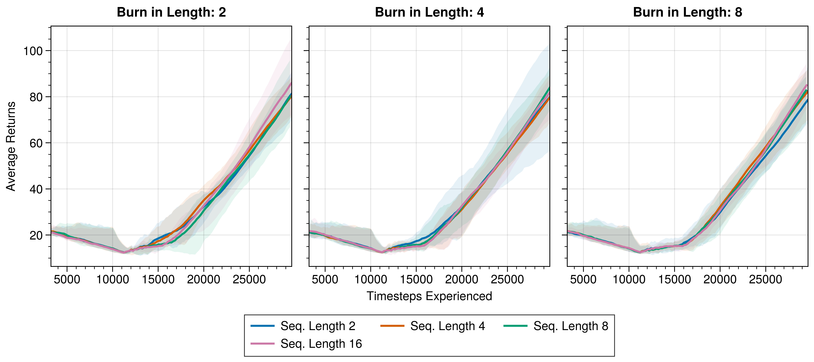
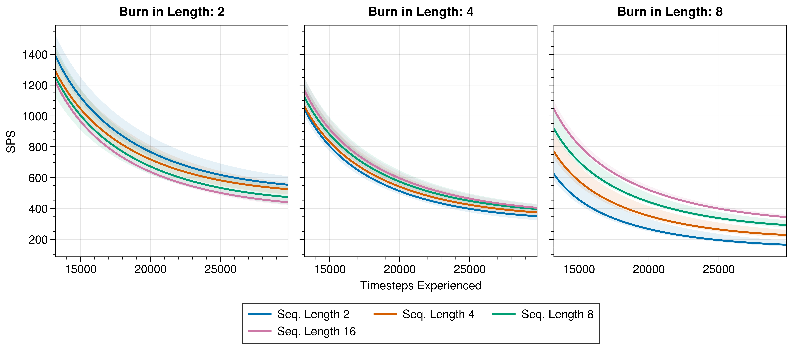

# R2D2
Implementation of R2D2 algorithm [(Kapturowski, Ostrovski Quan, Munos, Dabney. 2019.)](https://openreview.net/forum?id=r1lyTjAqYX). Allows usage of RNNs with Q-Learning, in particular needing to handle issues with the memory buffer to return consecutive sequences of steps, rather than individual steps.

This file structure is inspired by [cleanrl](https://github.com/vwxyzjn/cleanrl) and [pytorch-a2c-ppo-acktr-gail](https://github.com/ikostrikov/pytorch-a2c-ppo-acktr-gail).

# Example usage

```
python r2d2_algo/r2d2.py --env-id CartPole-v1
```

# Files

storage.py: Contains SequenceReplayBuffer class which is a memory buffer for sequences. The original R2D2 seems to suggest storing individual sequences as memories. SequenceReplayBuffer stores a single continual buffer as a regular ReplayBuffer would for each data type (e.g., observations or actions) and samples sequences from that buffer. Importantly, we also append a prefix (of burn_in_length steps) and suffix (of sequence_length steps) to each buffer. We also need to be careful when looping back and overwriting previous parts of the buffer what constitutes valid sequencces.

model.py: Contains basic RNNQNetwork which uses a GRU for the RNN layer, and additional ResettingGRU class. ResettingGRU adds functionality to standard GRU layer, allowing you to pass 'dones' along with 'inputs' and 'hidden_states' on the forward call, which tells the GRU when it needs to reset back to zeros for hidden state in the middle of a sequence. This is used if the SequenceReplayBuffer gives us sequence samples that include episode ends in the middle. ResettingGRU will try to batch as much of the forward pass as possible, by batching input rows where there are no dones. But be aware that this does slow down the GRU a lot. 

r2d2.py: The actual algorithm which performs data collection and loss calculations. Also does some logging functionality.

args.py: Separating out arguments

# Example performance on CartPole-v1

Performance on CartPole-v1 with varying sequence_lengths and burn_in_lengths:



In CartPole, sequence_lengths for training don't make a huge difference. We expect more impact on more memory-based environments.

SPS with varying sequence_lengths and burn_in_lengths



Note that SPS is higher the fewer combined burn_in_length+sequence_length steps. This is due to unbatched forward computation in ResettingGRU. The fewer training sequence steps, the lower chance of dones in the middle of the sequence and the more batching we can do. As performance on CartPole improves and episodes in memory buffer becomes longer, batching will also increase and SPS will improve.

# Other files and folders

experiment_configs: Can save experiment configurations in here to run a bunch of experiments automatically.

scheduler.py: Runs the experiments in experiment_configs folder.

```python scheduler.py```

write_and_test: Some side Jupyter notebooks for playing with. 

    write_experiments.ipynb: Create experiment configurations for experiment_configs folder.

    read_experiments.py: Some extra plotting functionality.

runs: Store tensorboard run results in here.

saved_models: Can save trained models in here.

saved_checkpoints: Can save models over the course of training in here.